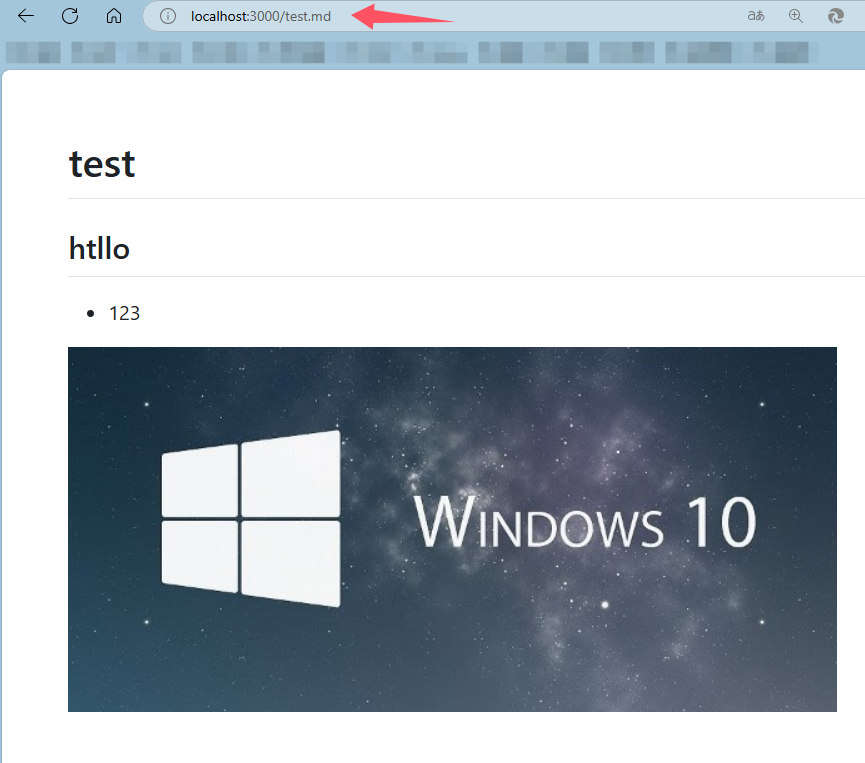
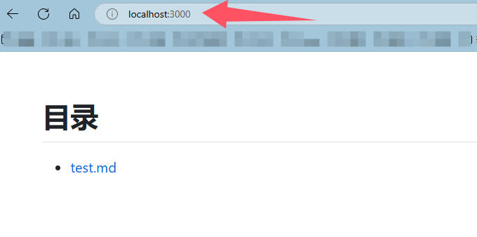

# markdown-static

## [DEMO](https://https://blog.yasol.cn)

## Install
```Bash
npm install markdown-static
```

## Ready
* mkdir assets,markdown
```Bash
/data
|-- assets
|   |-- 1.png
|-- markdown
    |-- test.md
```

* `test.md`
```markdown
# test

## htllo

* 123


```


## API
```
const markdownStatic = require("markdown-static");
markdownStatic({
  rootDir: "/data", // must
  delayMS: 5 * 1000, // default 5s
  appServerPort: 3000, // appServerPort, default 3000
  staticServerPort: 3001, // staticServerPort, default 3001
  markdownServerPort: 3002, // markdownServerPort, default 3002
});
```

* visit

